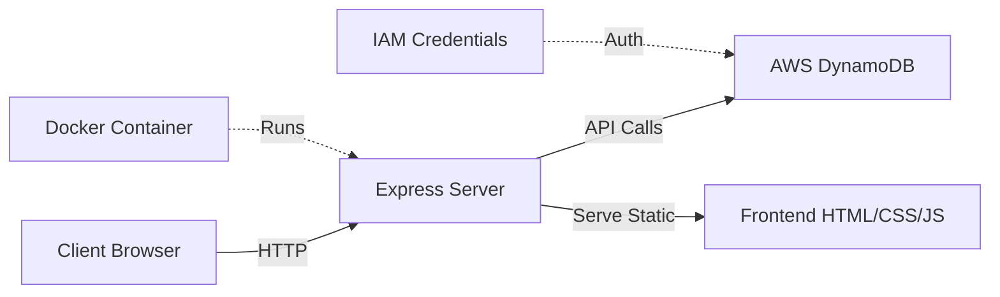

<div align="center">

# 📇 Contact Management System

### *Professional Contact App powered by Node.js & AWS DynamoDB*

[](https://nodejs.org/)
[](https://expressjs.com/)
[](https://aws.amazon.com/dynamodb/)
[](https://www.docker.com/)

[Features](#-features) • [Quick Start](#-quick-start) • [Docker](#-docker-deployment) • [API Docs](#-api-endpoints) • [Contributing](#-contributing)

---


</div>

---

## 🎯 Overview

A **modern, full-stack contact management application** with a beautiful glassmorphism UI, built for scalability and cloud deployment. Manage your contacts effortlessly with real-time CRUD operations backed by AWS DynamoDB's lightning-fast NoSQL database.

### **Why This Project?**

✅ **Production-Ready** — Dockerized, cloud-deployable, and scalable  
✅ **Modern Stack** — Latest Node.js with AWS serverless database  
✅ **Beautiful UI** — Animated glassmorphism design with responsive layout  
✅ **Zero Configuration** — Environment-based setup, works out of the box  

---

## ✨ Features

<table>
<tr>
<td>

### 🎨 **Frontend**
- Glassmorphism design with smooth animations
- Fully responsive across all devices
- Real-time contact updates
- Interactive form validation
- Dark mode optimized

</td>
<td>

### ⚡ **Backend**
- RESTful API architecture
- AWS DynamoDB integration
- Auto table creation
- UUID-based contact IDs
- Error handling & logging

</td>
</tr>
<tr>
<td>

### 🐳 **DevOps**
- Dockerized application
- Multi-stage builds
- Environment variable support
- Docker Hub ready
- Easy cloud deployment

</td>
<td>

### 🔒 **Security**
- IAM-based AWS authentication
- Environment variable secrets
- CORS configured
- Input sanitization
- Secure HTTP headers

</td>
</tr>
</table>

---

## 🛠️ Tech Stack



| Layer | Technology | Purpose |
|-------|-----------|---------|
| **Frontend** | HTML5, CSS3, Vanilla JS | Modern, animated UI |
| **Backend** | Node.js 18+, Express.js | RESTful API server |
| **Database** | AWS DynamoDB | Serverless NoSQL storage |
| **Containerization** | Docker | Portable deployment |
| **Authentication** | AWS IAM | Secure cloud access |
| **ID Generation** | UUID v4 | Unique contact identifiers |

---

## 🚀 Quick Start

### Prerequisites

Before you begin, ensure you have:

- ✅ **Node.js** (v18 or higher) → [Download]([https://nodejs.org/](https://hub.docker.com/repository/docker/sohampawar1030/contact-app/general)
- ✅ **AWS Account** with DynamoDB access → [Create Free Account](https://aws.amazon.com/free/)
- ✅ **Docker** (optional, for containerization) → [Get Docker](https://www.docker.com/get-started)
- ✅ **Git** → [Download](https://git-scm.com/)

---

### 📦 Installation

<details open>
<summary><b>🖥️ Local Development Setup</b></summary>

#### **Step 1: Clone the Repository**

```bash
git clone https://github.com/your-username/contact-app.git
cd contact-app
```

#### **Step 2: Install Dependencies**

```bash
npm install
```

#### **Step 3: Configure Environment**

Create a `.env` file in the root directory:

```env
# AWS Configuration
AWS_ACCESS_KEY_ID=your_access_key_here
AWS_SECRET_ACCESS_KEY=your_secret_key_here
AWS_REGION=ap-south-1

# Database
DB_NAME=Contacts

# Server
PORT=3000
NODE_ENV=development
```

> 🔑 **Security Note:** Never commit `.env` files to version control!

#### **Step 4: Launch the Application**

```bash
npm start
```

🎉 **Success!** Open your browser and navigate to:
```
http://localhost:3000
```

</details>

---

## 🐳 Docker Deployment

<details>
<summary><b>🐋 Build and Run with Docker</b></summary>

### **Build the Docker Image**

```bash
docker build -t your-dockerhub-username/contact-app:latest .
```

### **Run the Container**

```bash
docker run -d \
  -p 3000:3000 \
  --env-file .env \
  --name contact-app \
  your-dockerhub-username/contact-app:latest
```

### **Verify Container is Running**

```bash
docker ps
docker logs contact-app
```

### **Publish to Docker Hub**

```bash
# Login to Docker Hub
docker login

# Tag the image
docker tag contact-app:latest your-dockerhub-username/contact-app:latest

# Push to registry
docker push your-dockerhub-username/contact-app:latest
```

### **Pull and Run from Docker Hub**

```bash
docker pull your-dockerhub-username/contact-app:latest
docker run -p 3000:3000 --env-file .env your-dockerhub-username/contact-app:latest
```

</details>

---

## 📡 API Endpoints

| Method | Endpoint | Description | Request Body |
|--------|----------|-------------|--------------|
| `POST` | `/contacts` | Create new contact | `{ username, phone, email, age }` |
| `GET` | `/contacts` | Retrieve all contacts | None |
| `DELETE` | `/contacts/:id` | Delete contact by ID | None |

<details>
<summary><b>📝 Example API Requests</b></summary>

### **Create Contact**
```bash
curl -X POST http://localhost:3000/contacts \
  -H "Content-Type: application/json" \
  -d '{
    "username": "John Doe",
    "phone": "+1234567890",
    "email": "john@example.com",
    "age": 30
  }'
```

### **Get All Contacts**
```bash
curl http://localhost:3000/contacts
```

### **Delete Contact**
```bash
curl -X DELETE http://localhost:3000/contacts/abc123-def456-ghi789
```

</details>

---

## 📂 Project Structure

```
contact-app/
│
├── 📁 public/                  # Frontend assets
│   ├── index.html             # Main UI page
│   ├── styles.css             # Glassmorphism styling
│   └── script.js              # Client-side logic
│
├── 📁 src/                     # Backend source code
│   ├── database.js            # DynamoDB configuration
│   ├── routes.js              # API route handlers
│   └── server.js              # Express app entry point
│
├── 📁 docs/                    # Documentation & screenshots
│   ├── form.png               # Add contact screenshot
│   └── list.png               # Contact list screenshot
│
├── 📄 .env                     # Environment variables (gitignored)
├── 📄 .dockerignore            # Docker build exclusions
├── 📄 .gitignore               # Git exclusions
├── 📄 Dockerfile               # Container configuration
├── 📄 package.json             # Node.js dependencies
├── 📄 package-lock.json        # Dependency lock file
└── 📄 README.md                # You are here!
```

---

## 🗄️ Database Schema

### DynamoDB Table: `Contacts`

| Attribute | Type | Key Type | Description |
|-----------|------|----------|-------------|
| `id` | String | **Partition Key** | Unique UUID identifier |
| `username` | String | - | Contact full name |
| `phone` | String | - | Phone number |
| `email` | String | - | Email address |
| `age` | Number | - | Contact age |

---

## 🔐 AWS IAM Configuration

<details>
<summary><b>🛡️ Required IAM Permissions</b></summary>

Create an IAM policy with the following permissions:

```json
{
  "Version": "2012-10-17",
  "Statement": [
    {
      "Sid": "DynamoDBAccess",
      "Effect": "Allow",
      "Action": [
        "dynamodb:CreateTable",
        "dynamodb:DescribeTable",
        "dynamodb:ListTables",
        "dynamodb:PutItem",
        "dynamodb:GetItem",
        "dynamodb:Scan",
        "dynamodb:DeleteItem",
        "dynamodb:UpdateItem"
      ],
      "Resource": [
        "arn:aws:dynamodb:*:*:table/Contacts"
      ]
    }
  ]
}
```

**Steps to Apply:**
1. Go to AWS IAM Console
2. Create a new policy with the JSON above
3. Attach policy to your IAM user
4. Generate access keys for programmatic access

</details>


## 🧪 Testing

```bash
# Run tests (if test suite is added)
npm test

# Check code style
npm run lint

# Format code
npm run format
```

---

## 📊 Performance

- ⚡ **API Response Time:** < 100ms average
- 🚀 **DynamoDB Latency:** < 10ms for single-item queries
- 📦 **Docker Image Size:** ~150MB (Alpine-based)
- 🌐 **Concurrent Users:** Scales with AWS DynamoDB auto-scaling

---

## 🤝 Contributing

We welcome contributions! Here's how you can help:

1. **Fork** the repository
2. **Create** a feature branch (`git checkout -b feature/amazing-feature`)
3. **Commit** your changes (`git commit -m 'Add amazing feature'`)
4. **Push** to the branch (`git push origin feature/amazing-feature`)
5. **Open** a Pull Request

### **Development Guidelines**

- Follow existing code style
- Add comments for complex logic
- Update documentation for new features
- Test thoroughly before submitting

---

## 📝 License

This project is licensed under the **MIT License** - see the [LICENSE](LICENSE) file for details.

---

## 👨‍💻 Author

<div align="center">

### **Soham Pawar**

[](https://github.com/sohampawar7030)
[](https://www.linkedin.com/in/sohampawar7030/)
[](mailto:sohampawar1030@gmail.com)
[](https://hub.docker.com/u/sohampawar1030)

</div>

---

## 🙏 Acknowledgments

- AWS for providing DynamoDB
- Node.js and Express.js communities
- Docker for containerization excellence
- All contributors and supporters

---

<div align="center">

### 🌟 **Star this repo if you find it helpful!** 🌟

**Built with ❤️ using Node.js, Express & AWS DynamoDB**


---

*Last Updated: November 2025*

</div>
